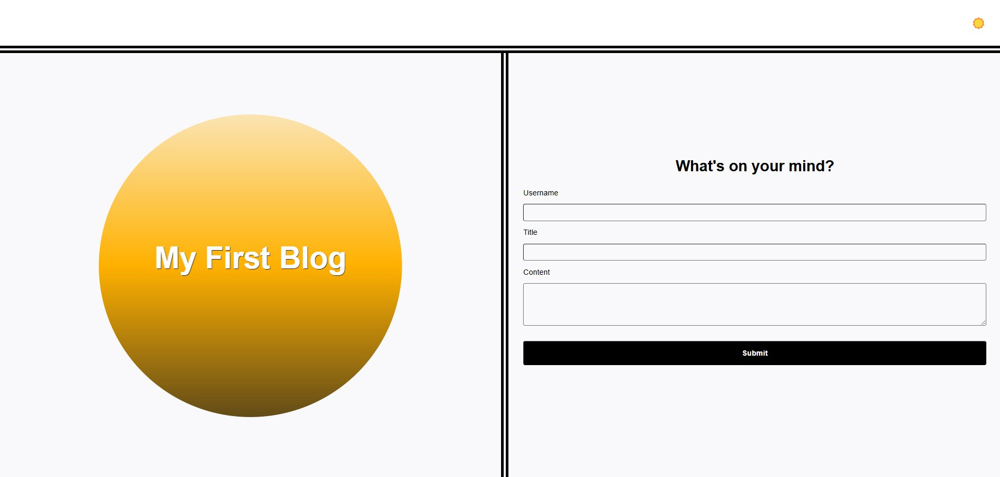
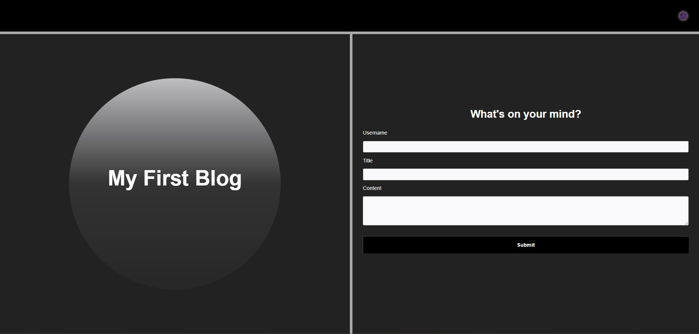
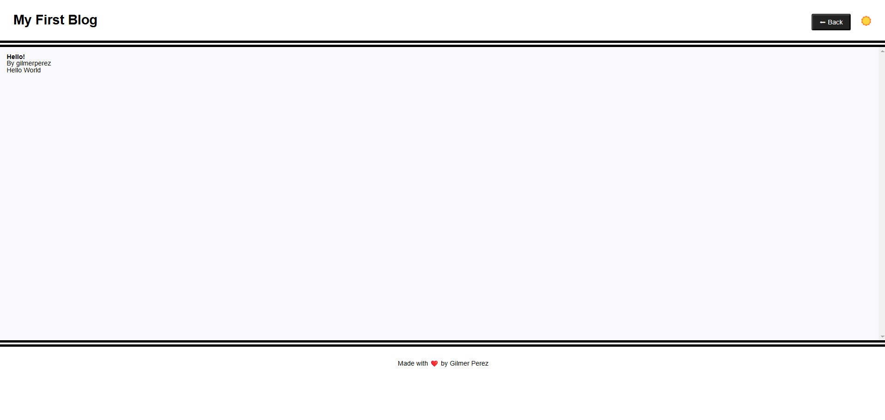

# Personal Blog

## Project Overview

This project is a two-page website where users can input and view blog posts. It includes a content form, dynamically rendered blog posts, and a light/dark mode toggle. This project helped me gain practical JavaScript experience, explore the power of the Document Object Model (DOM), and prepare for more advanced tasks.

## Table of Contents

- [Usage](#usage)
- [Mock Up](#mock-up)
- [Instructions](#instructions)
- [Key Features](#key-features)
- [Technology Stack](#technology-stack)

## Usage

The application is invoked by opening the `index.html` in a browser.

## Mock-Up

The following images show the web application's appearance and functionality:

## Instructions

1. The landing page allows users to fill out a form with fields for username, blog title, and blog content. The form validates input and displays an error message if any field is left empty.

2. When the form is submitted successfully, the data is stored in `localStorage` as a JSON array of blog post objects.

3. After submission, the user is redirected to the posts page, where all blog entries are displayed.

4. On the posts page, users can toggle between light and dark modes using a button and can return to the landing page by clicking the "Back" button.

## Key Features

- **Back Navigation:** A "Back" button allows users to return to the landing page for adding more entries.
- **Light/Dark Mode Toggle:** Users can switch between light and dark modes, and the styles update accordingly.
- **Data Storage:** Blog post data is stored in `localStorage` as JSON, making the posts persistent across sessions.
- **Blog Creation:** A form to input a username, blog title, and blog content, with validation to ensure all fields are filled.
- **Dynamic Blog List:** Blog posts are dynamically rendered on the posts page with information such as the title, content, and author.

## Technology Stack

This project uses the following technologies:
* **HTML and CSS:** Structures and styles the landing and posts pages.
* **LocalStorage:** Ensures that blog data is stored persistently between sessions.
* **JavaScript:** Handles form validation, blog data storage in `localStorage`, dynamic content rendering, and light/dark mode logic.
